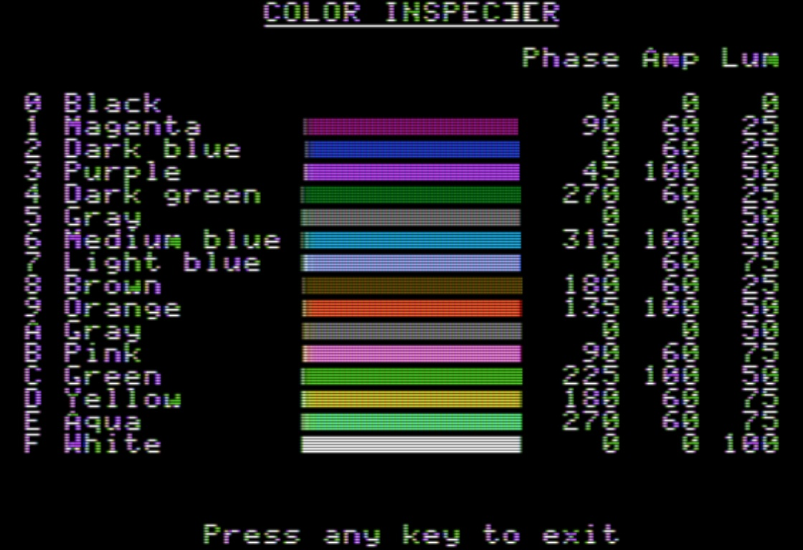

<!--
SPDX-FileCopyrightText: © 2023 Ryan Carsten Schmidt <https://github.com/ryandesign>
SPDX-License-Identifier: MIT
-->



Color Inspector is an Apple II program written in 6502 assembly that displays a
single screen showing the sixteen available colors along with their names and
numbers and the chrominance (phase and amplitude) and luma values the hardware
uses to achieve them in the composite video signal. It can be used to verify
that a monitor or emulator is producing accurate colors and that an emulator
implements various aspects of the Apple II architecture correctly.

## Compatibility

Color Inspector uses the vaporlock technique to detect the start of each video
frame and switches between text and graphics modes during each frame, so it
requires a real Apple II computer or an emulator that implements instruction
timing, the floating bus, and intraframe mode switches correctly.

It requires exact timing so on the IIɢs or other machines with accelerators you
must set the machine to 1 MHz first.

### Real hardware

Color Inspector has only been tested on an Apple //e but the following models
should be compatible:

* Apple ][, Apple ][ plus
* Apple //e, enhanced Apple //e, platinum Apple IIe
* Apple //c
* Apple IIɢs

The following models are not currently compatible:

* Apple ][ europlus and PAL versions of Apple //e (different video timing)
* Apple //c plus (different ROM WAIT routine timing)
* Apple ///, Apple /// plus, Apple IIe Card for Macintosh (no floating bus)

Expect problems with clones too.

### Emulators

The following emulators are compatible:

* AppleWin
* Clock Signal (2023-11-14 and newer)
* MAME
* Mariani

The following emulators are not currently compatible:

* OpenEmulator
* Virtual ][

## Building

To build Color Inspector, install [cc65](https://github.com/cc65/cc65) and run:

```
make
```

To make a disk image that can be loaded into an emulator or transferred to a
real floppy disk using [adtpro](https://github.com/ADTPro/adtpro), install
[c2d](https://github.com/datajerk/c2d) and run:

```
make dsk
```

To make an audio file that can be played into a real Apple II, install
[c2t](https://github.com/datajerk/c2t) and run:

```
make aif
```

To play that audio file into a real Apple II on macOS, connect an audio cable
between your Mac's audio out port and the cassette in port of an Apple ][ plus,
Apple //e, enhanced Apple //e, or platinum Apple IIe, and on the Apple II run:

```
LOAD
```

and on the Mac run:

```
make play
```

## License

Color Inspector is released under the MIT license. It uses vaporlock and a
routine to print decimal numbers, each of which are under different licenses.
See the LICENSES directory for the full license texts.
